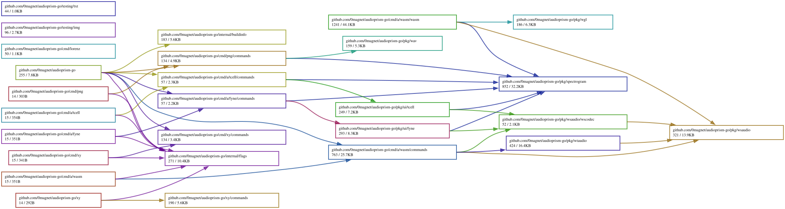

[](https://goreportcard.com/report/github.com/0magnet/audioprism-go)

# audioprism-go

**Work In Progress**

A spectrogram viewer, inspired by [audioprism](https://github.com/vsergeev/audioprism)
and differing from it substantially in how it is built.

What is shared with audioprism is the idea and some of the vocabulary: a live
scrolling spectrogram, the same window functions by name, and a heat colour
scheme that follows the same black-blue-green-yellow-red-white progression.

What is not: the DFT and window functions come from
[go-dsp](https://github.com/0magnet/go-dsp) rather than FFTW; there are six
colour schemes here, three of them published perceptually uniform colormaps that
audioprism does not have; and the whole of the rest of this -- five frontends
(C.O.R.E., Fyne, gomobile, tcell and WebAssembly), audio over WebSocket and
WebTransport, the offline PNG renderer and the CLI -- has no counterpart in it,
which is built on SDL2, FFTW and ImageMagick with a thread-per-stage design.

## Frontends

* [Fyne](https://github.com/fyne-io/fyne)
* [Go mobile](https://pkg.go.dev/golang.org/x/mobile)
* [Tcell](github.com/gdamore/tcell)
* Web Assembly WASM (web)

## Audio Source

Support for **pulseaudio** via  "[github.com/jfreymuth/pulse](https://github.com/jfreymuth/pulse)" library

## Colour schemes

`--colors` takes one of six.

| | |
|---|---|
| `heat` | black-blue-green-yellow-red-white, the default |
| `blue` | black-blue-white |
| `grayscale` | black-white |
| `turbo` | Google's turbo |
| `viridis` | matplotlib's viridis |
| `magma` | matplotlib's magma |

The first three are piecewise-linear ramps between corner colours. The last
three are lookup tables from maps designed to be **perceptually uniform** --
equal steps in magnitude look like equal steps in brightness, which a linear
ramp does not manage, so they neither invent banding where the data is smooth
nor flatten detail where it is not.

One surprise worth knowing: `turbo` and `viridis` do not start at black, so
silence is dark purple rather than black. That is the maps working as intended
-- reserving pure black would waste the darkest part of the range -- but if you
want a black floor, `magma`, `heat` or `grayscale` give you one.

## Test Signals

```
# Simple tones
speaker-test -t sine -f 440 -l 1        # 440Hz tone
speaker-test -t sine -f 1000 -l 1       # 1kHz tone
ffmpeg -f lavfi -i "sine=f=440:d=5" -f pulse default     # 440Hz for 5s
ffmpeg -f lavfi -i "sine=f=1000:d=5" -f pulse default    # 1kHz for 5s

# Noise (great for testing frequency distribution)
speaker-test -t pink -l 1               # Pink noise
ffmpeg -f lavfi -i "anoisesrc=d=5:c=pink" -f pulse default    # Pink noise
ffmpeg -f lavfi -i "anoisesrc=d=5:c=white" -f pulse default   # White noise

# Frequency sweep (100Hz to 5kHz over 10 seconds)
ffmpeg -f lavfi -i "aevalsrc=sin(2*PI*(100+490*t/10)*t):d=10" -f pulse default

# Multi-frequency chord (A440 + E660 + C523)
ffmpeg -f lavfi -i "aevalsrc=sin(2*PI*440*t)+sin(2*PI*660*t)+sin(2*PI*523.25*t):d=5" -f pulse default

# Square wave (rich harmonics)
ffmpeg -f lavfi -i "aevalsrc=sin(2*PI*440*t)+0.3*sin(6*PI*440*t)+0.2*sin(10*PI*440*t):d=5" -f pulse default

# Exponential sweep
ffmpeg -f lavfi -i "aevalsrc=sin(2*PI*100*exp(t/2)*t):d=10" -f pulse default
```

## Help Menus

```
$ go run github.com/0magnet/audioprism-go@master
audioprism-go
┌─┐┬ ┬┌┬┐┬┌─┐┌─┐┬─┐┬┌─┐┌┬┐   ┌─┐┌─┐
├─┤│ │ ││││ │├─┘├┬┘│└─┐│││───│ ┬│ │
┴ ┴└─┘─┴┘┴└─┘┴  ┴└─┴└─┘┴ ┴   └─┘└─┘
Audio Spectrogram Visualization
v0.0.0-20251029125916-f0f764bde1c6
built with go1.25.3 X:nodwarf5

Usage:
  audioprism-go

Available Commands:
  c         with core
  d         with CORE web UI via websockets
  f         with fyne
  m         with gomobile
  t         with tcell
  w         with wasm via websockets

Flags:
  -b, --bv     print runtime/debug.BuildInfo.Main.Version
  -d, --info   print runtime/debug.BuildInfo

```

```
go run cmd/core/core.go --help
┌─┐┌─┐┬─┐┌─┐
│  │ │├┬┘├┤
└─┘└─┘┴└─└─┘
Audio Spectrogram Visualization with core

Usage:
  core


Flags:
  -b, --buf int            size of audio buffer (default 32768)
  -s, --fps                show fps
  -y, --height int         initial window height (default 512)
  -u, --up int             fps rate - 0 unlimits (default 60)
  -k, --websocket string   websocket url (i.e. 'ws://127.0.0.1:8080/ws')
  -x, --width int          initial window width (default 512)
go run cmd/coreweb/coreweb.go --help

	┌─┐┬ ┬┌┬┐┬┌─┐┌─┐┬─┐┬┌─┐┌┬┐   ┌─┐┌─┐
	├─┤│ │ ││││ │├─┘├┬┘│└─┐│││───│ ┬│ │
	┴ ┴└─┘─┴┘┴└─┘┴  ┴└─┴└─┘┴ ┴   └─┘└─┘
	Audio Spectrogram Visualization CogentCore Webassembly

Usage:
  coreweb


Flags:
  -y, --height int   height of spectrogram display - set on wasm compilation (default 512)
  -p, --port int     port to serve on (default 8080)
  -x, --width int    width of spectrogram display - set on wasm compilation (default 512)
go run cmd/fyne/fyne.go --help
┌─┐┬ ┬┌┐┌┌─┐
├┤ └┬┘│││├┤
└   ┴ ┘└┘└─┘
Audio Spectrogram Visualization with fyne

Usage:
  fyne


Flags:
  -b, --buf int            size of audio buffer (default 32768)
  -s, --fps                show fps
  -y, --height int         initial window height (default 512)
  -u, --up int             fps rate - 0 unlimits (default 60)
  -k, --websocket string   websocket url (i.e. 'ws://127.0.0.1:8080/ws')
  -x, --width int          initial window width (default 512)
go run cmd/gomobile/gomobile.go --help
┌─┐┌─┐┌┬┐┌─┐┌┐ ┬┬  ┌─┐
│ ┬│ │││││ │├┴┐││  ├┤
└─┘└─┘┴ ┴└─┘└─┘┴┴─┘└─┘
Audio Spectrogram Visualization with gomobile

Usage:
  gomobile


Flags:
  -b, --buf int            size of audio buffer (default 32768)
  -s, --fps                show fps
  -y, --height int         initial window height (default 512)
  -u, --up int             fps rate - 0 unlimits (default 60)
  -k, --websocket string   websocket url (i.e. 'ws://127.0.0.1:8080/ws')
  -x, --width int          initial window width (default 512)
go run cmd/tcell/tcell.go --help
┌┬┐┌─┐┌─┐┬  ┬  
 │ │  ├┤ │  │  
 ┴ └─┘└─┘┴─┘┴─┘
Audio Spectrogram Visualization with tcell

Usage:
  tcell


Flags:
  -b, --buf int            size of audio buffer (default 32768)
  -s, --fps                show fps
  -y, --height int         initial window height (default 512)
  -u, --up int             fps rate - 0 unlimits (default 60)
  -k, --websocket string   websocket url (i.e. 'ws://127.0.0.1:8080/ws')
  -x, --width int          initial window width (default 512)
go run cmd/wasm/wasm.go --help

	┌─┐┬ ┬┌┬┐┬┌─┐┌─┐┬─┐┬┌─┐┌┬┐   ┌─┐┌─┐
	├─┤│ │ ││││ │├─┘├┬┘│└─┐│││───│ ┬│ │
	┴ ┴└─┘─┴┘┴└─┘┴  ┴└─┴└─┘┴ ┴   └─┘└─┘
	Audio Spectrogram Visualization in Webassembly

Usage:
  wasm

Available Commands:

Flags:
  -d, --dev            compile wasm from source
  -y, --height int     height of spectrogram display - set on wasm compilation (default 512)
  -p, --port int       port to serve on (default 8080)
  -t, --tinygo         compile wasm from source with tinygo
  -x, --width int      width of spectrogram display - set on wasm compilation (default 512)
  -w, --wpath string   path to wasm source in dev mode (default "cmd/wasm/wasm/b.go")
go run . --help
audioprism-go
┌─┐┬ ┬┌┬┐┬┌─┐┌─┐┬─┐┬┌─┐┌┬┐   ┌─┐┌─┐
├─┤│ │ ││││ │├─┘├┬┘│└─┐│││───│ ┬│ │
┴ ┴└─┘─┴┘┴└─┘┴  ┴└─┴└─┘┴ ┴   └─┘└─┘
Audio Spectrogram Visualization
(devel)
built with go1.25.3 X:nodwarf5

Usage:
  audioprism-go

Available Commands:
  c         with core
  d         with CORE web UI via websockets
  f         with fyne
  m         with gomobile
  t         with tcell
  w         with wasm via websockets

Flags:
  -b, --bv     print runtime/debug.BuildInfo.Main.Version
  -d, --info   print runtime/debug.BuildInfo
go run . c --help
┌─┐ ┌─┐ ┬─┐ ┌─┐
│   │ │ ├┬┘ ├┤  
└─┘o└─┘o┴└─o└─┘o
Audio Spectrogram Visualization with C.O.R.E. GUI

Usage:
  audioprism-go c


Flags:
  -b, --buf int            size of audio buffer (default 32768)
  -s, --fps                show fps
  -y, --height int         initial window height (default 512)
  -u, --up int             fps rate - 0 unlimits (default 60)
  -k, --websocket string   websocket url (i.e. 'ws://127.0.0.1:8080/ws')
  -x, --width int          initial window width (default 512)
go run . d --help
┌─┐ ┌─┐ ┬─┐ ┌─┐   ┬ ┬┌─┐┌┐   ┬ ┬┬
│   │ │ ├┬┘ ├┤    │││├┤ ├┴┐  │ ││
└─┘o└─┘o┴└─o└─┘o  └┴┘└─┘└─┘  └─┘┴
Audio Spectrogram Visualization with C.O.R.E. web GUI

Usage:
  audioprism-go d


Flags:
  -y, --height int   height of spectrogram display - set on wasm compilation (default 512)
  -p, --port int     port to serve on (default 8080)
  -x, --width int    width of spectrogram display - set on wasm compilation (default 512)
go run . f --help
┌─┐┬ ┬┌┐┌┌─┐
├┤ └┬┘│││├┤
└   ┴ ┘└┘└─┘
Audio Spectrogram Visualization with Fyne GUI

Usage:
  audioprism-go f


Flags:
  -b, --buf int            size of audio buffer (default 32768)
  -s, --fps                show fps
  -y, --height int         initial window height (default 512)
  -u, --up int             fps rate - 0 unlimits (default 60)
  -k, --websocket string   websocket url (i.e. 'ws://127.0.0.1:8080/ws')
  -x, --width int          initial window width (default 512)
go run . m --help
┌─┐┌─┐┌┬┐┌─┐┌┐ ┬┬  ┌─┐
│ ┬│ │││││ │├┴┐││  ├┤
└─┘└─┘┴ ┴└─┘└─┘┴┴─┘└─┘
Audio Spectrogram Visualization with golang.org/x/mobile GUI

Usage:
  audioprism-go m


Flags:
  -b, --buf int            size of audio buffer (default 32768)
  -s, --fps                show fps
  -y, --height int         initial window height (default 512)
  -u, --up int             fps rate - 0 unlimits (default 60)
  -k, --websocket string   websocket url (i.e. 'ws://127.0.0.1:8080/ws')
  -x, --width int          initial window width (default 512)
go run . t --help
┌┬┐┌─┐┌─┐┬  ┬  
 │ │  ├┤ │  │  
 ┴ └─┘└─┘┴─┘┴─┘
Audio Spectrogram Visualization with Tcell TUI

Usage:
  audioprism-go t


Flags:
  -b, --buf int            size of audio buffer (default 32768)
  -s, --fps                show fps
  -y, --height int         initial window height (default 512)
  -u, --up int             fps rate - 0 unlimits (default 60)
  -k, --websocket string   websocket url (i.e. 'ws://127.0.0.1:8080/ws')
  -x, --width int          initial window width (default 512)
go run . w --help
┬ ┬┌─┐┌─┐┌┬┐
│││├─┤└─┐│││
└┴┘┴ ┴└─┘┴ ┴
Audio Spectrogram Visualization in Webassembly

Usage:
  audioprism-go w


Flags:
  -d, --dev            compile wasm from source
  -y, --height int     height of spectrogram display - set on wasm compilation (default 512)
  -p, --port int       port to serve on (default 8080)
  -t, --tinygo         compile wasm from source with tinygo
  -x, --width int      width of spectrogram display - set on wasm compilation (default 512)
  -w, --wpath string   path to wasm source in dev mode (default "cmd/wasm/wasm/b.go")

```
## Dependency Graph

Made with [goda](https://github.com/loov/goda):

```
# GOOS=js: the import edges of a wasm program live in js/wasm-tagged
# files and are invisible to a host-context run
GOOS=js GOARCH=wasm go run github.com/loov/goda@latest graph github.com/0magnet/audioprism-go/... | dot -Tsvg -o docs/audioprism-go-goda-graph.svg
```



## Lines of Code

Made with [gocloc](https://github.com/hhatto/gocloc) (excludes `vendor/`, `node_modules/`, `.git/`):

```
gocloc --not-match-d='(vendor|node_modules|\.git)' .
```

```
-------------------------------------------------------------------------------
Language                     files          blank        comment           code
-------------------------------------------------------------------------------
Go                              41            711           1025           5223
JavaScript                       4            180             93           1255
Markdown                         3            122              0            349
CSS                              1             21              2            124
BASH                             4             34             47            114
YAML                             1              0              7             98
HTML                             2              8              0             84
Makefile                         1             14             16             54
Bourne Shell                     1              8             16             30
JSON                             2              0              0             28
-------------------------------------------------------------------------------
TOTAL                           60           1098           1206           7359
-------------------------------------------------------------------------------
```
