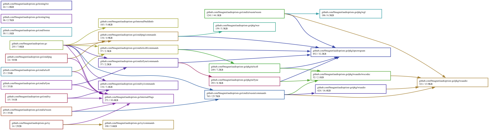

[](https://goreportcard.com/report/github.com/0magnet/audioprism-go)

# audioprism-go

**Work In Progress**

A spectrogram viewer, inspired by [audioprism](https://github.com/vsergeev/audioprism)
and differing from it substantially in how it is built.

What is shared with audioprism is the idea and some of the vocabulary: a live
scrolling spectrogram, the same window functions by name, and a heat color
scheme that follows the same black-blue-green-yellow-red-white progression.

What is not: the DFT and window functions come from
[go-dsp](https://github.com/0magnet/go-dsp) rather than FFTW; there are six
color schemes here, three of them published perceptually uniform colormaps that
audioprism does not have; and the whole of the rest of this -- four live frontends
(Fyne, gomobile, tcell and WebAssembly), audio over WebSocket and
WebTransport, the offline PNG renderer and the CLI -- has no counterpart in it,
which is built on SDL2, FFTW and ImageMagick with a thread-per-stage design.

## Frontends

Each is a subcommand of the root command. The live ones take the same spectrogram
flags (`--colors`, `--window`, `--magnitude-scale`, `--magnitude-min`,
`--magnitude-max`, `--dft-size`, `--overlap`), plus `-x/--width` and
`-y/--height` (640x480 by default), `-u/--up` for the frame rate, `-b/--buf` for
the audio buffer and `-s/--fps` to show the rate.

| command | frontend |
|---|---|
| `f` | [Fyne](https://github.com/fyne-io/fyne) |
| `t` | [Tcell](https://github.com/gdamore/tcell), in the terminal |
| `w` | WebAssembly: serves a page that draws the spectrogram in the browser |
| `m` | [Go mobile](https://pkg.go.dev/golang.org/x/mobile); needs cgo, so it is absent from builds without it |
| `p` | not live: `p <WAV in> <image out>` renders a WAV file to a PNG or JPEG |
| `xy` | an X-Y oscilloscope for stereo audio, described in [cmd/xy/README.md](cmd/xy/README.md) |

`f`, `t` and `m` take `-k/--websocket` to read audio from a WebSocket URL, such
as the one `w` serves, instead of the local sound server.

`w` serves on port 8080 by default (`-p/--port`, `--bind` to limit the
address). `--dev` and `--tinygo` compile the wasm from source (`--wpath` names
it, `cmd/a/wasm/wasm/b.go` by default) instead of using the embedded build, and
are offered only when `go` or `tinygo` is on the path; `-x` and `-y` set the
display size at that compilation. `--wt`, `--wt-port` and `--wt-path` control
the WebTransport endpoint, and `-s/--fps` shows the frame rate in the page.

`p` takes `--orientation` (horizontal or vertical) and `--quality` for JPEG
output, and spells the magnitude scale `logarithmic` where the live frontends
spell it `log`.

`cmd/lorenz` is a signal generator rather than a frontend: it writes a Lorenz
attractor as 48 kHz 32-bit float stereo PCM to stdout, to be piped into
ffmpeg and watched in `xy` (see `test2.sh`).

## Audio Source

By default the live frontends and `w` capture from the sound server through
PulseAudio (PipeWire's compatible server works) using
"[github.com/jfreymuth/pulse](https://github.com/jfreymuth/pulse)".

`w` has two other sources. `-D/--dir DIR` streams the audio files in a directory,
decoded and resampled by ffmpeg, instead of capturing; `-S/--shuffle` shuffles
that playlist. And whichever source is in use, `w` sends the audio to the page
over a WebSocket, which is the default, or over WebTransport (HTTP/3 over QUIC,
on UDP) when the page is opened with `?audio=wt`.

## Color schemes

`--colors` takes one of six.

| | |
|---|---|
| `heat` | black-blue-green-yellow-red-white, the default |
| `blue` | black-blue-white |
| `grayscale` | black-white |
| `turbo` | Google's turbo |
| `viridis` | matplotlib's viridis |
| `magma` | matplotlib's magma |

The first three are piecewise-linear ramps between corner colors. The last
three are lookup tables from maps designed to be **perceptually uniform** --
equal steps in magnitude look like equal steps in brightness, which a linear
ramp does not manage, so they neither invent banding where the data is smooth
nor flatten detail where it is not.

One surprise worth knowing: `turbo` and `viridis` do not start at black, so
silence is dark purple rather than black. That is the maps working as intended
-- reserving pure black would waste the darkest part of the range -- but if you
want a black floor, `magma`, `heat` or `grayscale` give you one.

## Test Signals

```
# Simple tones
speaker-test -t sine -f 440 -l 1        # 440Hz tone
speaker-test -t sine -f 1000 -l 1       # 1kHz tone
ffmpeg -f lavfi -i "sine=f=440:d=5" -f pulse default     # 440Hz for 5s
ffmpeg -f lavfi -i "sine=f=1000:d=5" -f pulse default    # 1kHz for 5s

# Noise (great for testing frequency distribution)
speaker-test -t pink -l 1               # Pink noise
ffmpeg -f lavfi -i "anoisesrc=d=5:c=pink" -f pulse default    # Pink noise
ffmpeg -f lavfi -i "anoisesrc=d=5:c=white" -f pulse default   # White noise

# Frequency sweep (100Hz to 5kHz over 10 seconds)
ffmpeg -f lavfi -i "aevalsrc=sin(2*PI*(100+490*t/10)*t):d=10" -f pulse default

# Multi-frequency chord (A440 + E660 + C523)
ffmpeg -f lavfi -i "aevalsrc=sin(2*PI*440*t)+sin(2*PI*660*t)+sin(2*PI*523.25*t):d=5" -f pulse default

# Square wave (rich harmonics)
ffmpeg -f lavfi -i "aevalsrc=sin(2*PI*440*t)+0.3*sin(6*PI*440*t)+0.2*sin(10*PI*440*t):d=5" -f pulse default

# Exponential sweep
ffmpeg -f lavfi -i "aevalsrc=sin(2*PI*100*exp(t/2)*t):d=10" -f pulse default
```

## Help Menus

Output of `go run . --help` and of `--help` on each subcommand:

```
$ go run . --help
audioprism-go
┌─┐┬ ┬┌┬┐┬┌─┐┌─┐┬─┐┬┌─┐┌┬┐   ┌─┐┌─┐
├─┤│ │ ││││ │├─┘├┬┘│└─┐│││───│ ┬│ │
┴ ┴└─┘─┴┘┴└─┘┴  ┴└─┴└─┘┴ ┴   └─┘└─┘
Audio Spectrogram Visualization
(devel)
built with go1.27.1-X:nodwarf5

Usage:
  audioprism-go

Available Commands:
  f                          with fyne
  m                          with gomobile
  p                          render a WAV file to a spectrogram image
  t                          with tcell
  w                          with wasm via websockets
  xy                         X-Y Audio scope

Flags:
  -b, --bv     print runtime/debug.BuildInfo.Main.Version
  -d, --info   print runtime/debug.BuildInfo

$ go run . f --help
┌─┐┬ ┬┌┐┌┌─┐
├┤ └┬┘│││├┤ 
└   ┴ ┘└┘└─┘
Audio Spectrogram Visualization with Fyne GUI

Usage:
  audioprism-go f


Flags:
  -b, --buf int                  size of audio buffer (default 32768)
      --colors string            color scheme: heat, blue, grayscale, turbo, viridis, magma (default "heat")
      --dft-size int             DFT size (power of 2, 64-8192) (default 1024)
  -s, --fps                      show fps
  -y, --height int               initial window height (default 480)
      --magnitude-max float      magnitude maximum (default 45)
      --magnitude-min float      magnitude minimum
      --magnitude-scale string   magnitude scale: log, linear (default "log")
      --overlap float            samples overlap percentage (5-95), or a ratio (0.05-0.95) (default 0.5)
  -u, --up int                   fps rate - 0 unlimits (default 60)
  -k, --websocket string         websocket url (i.e. 'ws://127.0.0.1:8080/ws')
  -x, --width int                initial window width (default 640)
      --window string            window function: hann, hamming, bartlett, rectangular (default "hann")

$ go run . m --help
┌─┐┌─┐┌┬┐┌─┐┌┐ ┬┬  ┌─┐
│ ┬│ │││││ │├┴┐││  ├┤ 
└─┘└─┘┴ ┴└─┘└─┘┴┴─┘└─┘
Audio Spectrogram Visualization with golang.org/x/mobile GUI

Usage:
  audioprism-go m


Flags:
  -b, --buf int                  size of audio buffer (default 32768)
      --colors string            color scheme: heat, blue, grayscale, turbo, viridis, magma (default "heat")
      --dft-size int             DFT size (power of 2, 64-8192) (default 1024)
  -s, --fps                      show fps
  -y, --height int               initial window height (default 480)
      --magnitude-max float      magnitude maximum (default 45)
      --magnitude-min float      magnitude minimum
      --magnitude-scale string   magnitude scale: log, linear (default "log")
      --overlap float            samples overlap percentage (5-95), or a ratio (0.05-0.95) (default 0.5)
  -u, --up int                   fps rate - 0 unlimits (default 60)
  -k, --websocket string         websocket url (i.e. 'ws://127.0.0.1:8080/ws')
  -x, --width int                initial window width (default 640)
      --window string            window function: hann, hamming, bartlett, rectangular (default "hann")

$ go run . t --help
┌┬┐┌─┐┌─┐┬  ┬  
 │ │  ├┤ │  │  
 ┴ └─┘└─┘┴─┘┴─┘
Audio Spectrogram Visualization with Tcell TUI

Usage:
  audioprism-go t


Flags:
  -b, --buf int                  size of audio buffer (default 32768)
      --colors string            color scheme: heat, blue, grayscale, turbo, viridis, magma (default "heat")
      --dft-size int             DFT size (power of 2, 64-8192) (default 1024)
  -s, --fps                      show fps
  -y, --height int               initial window height (default 480)
      --magnitude-max float      magnitude maximum (default 45)
      --magnitude-min float      magnitude minimum
      --magnitude-scale string   magnitude scale: log, linear (default "log")
      --overlap float            samples overlap percentage (5-95), or a ratio (0.05-0.95) (default 0.5)
  -u, --up int                   fps rate - 0 unlimits (default 60)
  -k, --websocket string         websocket url (i.e. 'ws://127.0.0.1:8080/ws')
  -x, --width int                initial window width (default 640)
      --window string            window function: hann, hamming, bartlett, rectangular (default "hann")

$ go run . w --help
┬ ┬┌─┐┌─┐┌┬┐
│││├─┤└─┐│││
└┴┘┴ ┴└─┘┴ ┴
Audio Spectrogram Visualization in Webassembly

Usage:
  audioprism-go w


Flags:
      --bind string      address to bind to; empty means every interface (e.g. 127.0.0.1 to serve only locally)
  -d, --dev              compile wasm from source
  -D, --dir string       stream audio files from this directory (via ffmpeg) instead of pulseaudio
  -s, --fps              show fps in wasm display
  -y, --height int       height of spectrogram display - set on wasm compilation (default 480)
  -p, --port int         port to serve on (default 8080)
  -S, --shuffle          shuffle the playlist (only with --dir)
  -t, --tinygo           compile wasm from source with tinygo
  -x, --width int        width of spectrogram display - set on wasm compilation (default 640)
  -w, --wpath string     path to wasm source in dev mode (default "cmd/a/wasm/wasm/b.go")
      --wt               also offer the audio over WebTransport (HTTP/3 over QUIC, UDP) for ?audio=wt; the WebSocket is unaffected and stays the default, and a WebTransport that fails to start is logged rather than fatal (default true)
      --wt-path string   WebTransport endpoint path (default "/wt")
      --wt-port int      UDP port for WebTransport (0 = the same number as --port; QUIC is UDP so the numbers can be shared, and sharing them keeps the browser's origin check happy)

$ go run . p --help
┌─┐┌┐┌┌─┐
├─┘││││ ┬
┴  ┘└┘└─┘
Audio Spectrogram Visualization from a WAV file to an image file

Usage:
  audioprism-go p


Flags:
      --colors string            color scheme: heat, blue, grayscale, turbo, viridis, magma (default "heat")
      --dft-size int             DFT size (power of 2, 64-8192) (default 1024)
  -y, --height int               height of spectrogram (default 480)
      --magnitude-max float      magnitude maximum (default 45)
      --magnitude-min float      magnitude minimum
      --magnitude-scale string   magnitude scale: logarithmic, linear (default "logarithmic")
      --orientation string       orientation: horizontal, vertical (default "vertical")
      --overlap float            samples overlap percentage (5-95), or a ratio (0.05-0.95) (default 0.5)
      --quality int              JPEG quality, when the output is a .jpg (default 95)
  -x, --width int                width of spectrogram (default 640)
      --window string            window function: hann, hamming, bartlett, rectangular (default "hann")

$ go run . xy --help
─┐ ┬┬ ┬
┌┴┬┘└┬┘
┴ └─ ┴ 
X-Y Audio Oscilloscope

Usage:
  audioprism-go xy


```

## Dependency Graph

Made with [goda](https://github.com/loov/goda):

```
# GOOS=js: the import edges of a wasm program live in js/wasm-tagged
# files and are invisible to a host-context run
GOOS=js GOARCH=wasm go run github.com/loov/goda@latest graph github.com/0magnet/audioprism-go/... | dot -Tsvg -o docs/audioprism-go-goda-graph.svg
```



## Lines of Code

Made with [gocloc](https://github.com/hhatto/gocloc) (excludes `vendor/`, `node_modules/`, `.git/`):

```
gocloc --not-match-d='(vendor|node_modules|\.git)' .
```

```
-------------------------------------------------------------------------------
Language                     files          blank        comment           code
-------------------------------------------------------------------------------
Go                              56            895           1784           7265
JavaScript                       1             61             36            478
Markdown                         3            118              0            362
Makefile                         1             21             52            111
YAML                             1              0              7             98
BASH                             4             22             38             83
Bourne Shell                     1              8             16             30
JSON                             2              0              0             21
-------------------------------------------------------------------------------
TOTAL                           69           1125           1933           8448
-------------------------------------------------------------------------------
```
